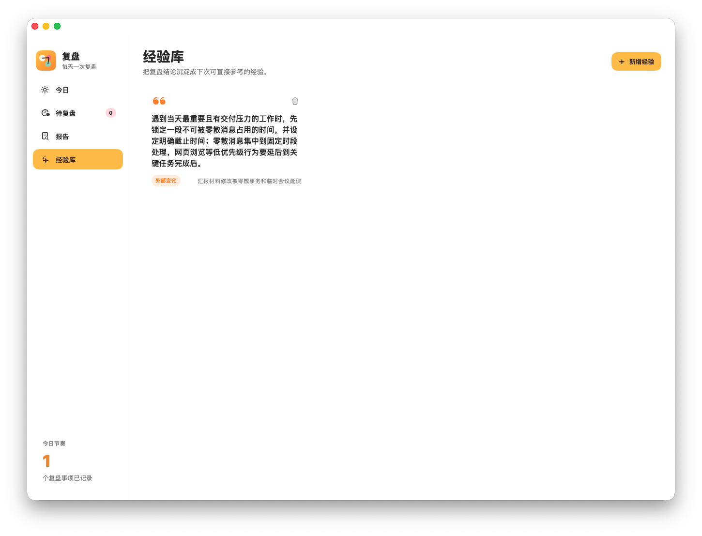

# 复盘

复盘是一款 macOS 本地客户端，用来记录每天值得复盘的事项，并通过 Codex CLI 生成结构化分析报告。

它不只面向“决策复盘”，也可以复盘拖延、遗忘、沟通失误、执行偏差、习惯问题和普通工作事项。



## 功能

- 今日事项记录
- 待复盘事项管理
- 经验库沉淀
- 周复盘报告
- 支持复盘类型：决策、拖延、遗忘、沟通、执行、习惯、工作、其他
- 支持通过 Codex CLI 调用 `gpt-5.5` 生成：
  - 结构化字段
  - 经验总结
  - 完整分析报告

## 使用方式

1. 点击 `记录一件事`
2. 在 `先随手写` 中用自然语言写下发生了什么
3. 点击 `AI 帮我整理`
4. 检查并保存结构化字段
5. 事情有结果后，回填 `实际结果`
6. 点击 `生成完整复盘`
7. 将关键经验沉淀到 `经验库`

## 示例输入

```text
今天本来计划上午把汇报材料改完，但我一直在处理零散消息，中间还刷了几次网页，想着下午再集中做。结果下午又被临时会议打断，最后到晚上才开始改，质量很一般，还影响了明天要交的版本。我感觉主要是上午没有先把最重要的事锁住，也没有给自己设一个明确的截止时间。
```

## 本地运行

环境要求：

- macOS 13+
- Swift 5.9+
- 已安装并登录 Codex CLI

运行：

```bash
swift run
```

构建：

```bash
swift build
```

## AI 调用说明

应用内 AI 功能通过本机 Codex CLI 调用，不直接接入 OpenAI SDK。

当前调用模型：

```bash
gpt-5.5
```

应用会调用类似命令：

```bash
codex -a never -s read-only exec --skip-git-repo-check --ignore-rules --ignore-user-config -m gpt-5.5
```

## 目录结构

```text
.
├── Package.swift
├── Sources/
│   └── DecisionReview/
│       └── DecisionReviewApp.swift
├── Scripts/
│   └── GenerateDecisionReviewIcon.swift
└── Docs/
    ├── screenshot.png
    └── icon.png
```

## 应用名称

应用名称：复盘

定位：每天一次复盘，把事件、原因、结果和经验沉淀下来。
